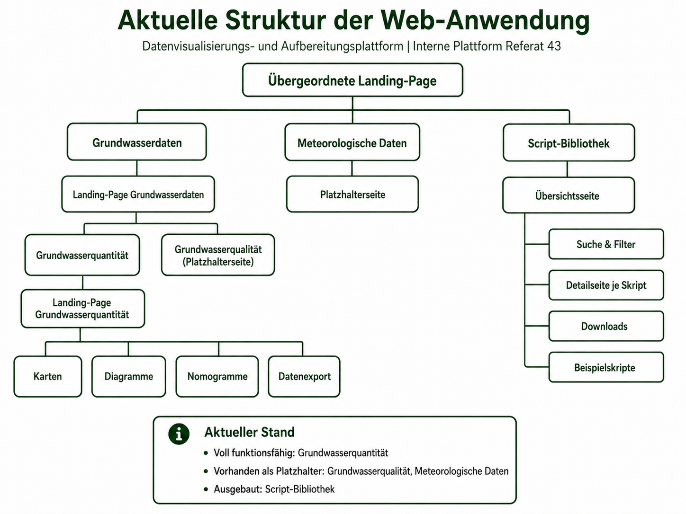

# Web-Struktur

Die Anwendung ist hierarchisch in eine übergeordnete Plattform, fachliche Bereiche und untergeordnete Funktionsseiten gegliedert.



## Hierarchie

```text
Übergeordnete Landing-Page
├── Grundwasserdaten
│   └── Landing-Page Grundwasserdaten
│       ├── Grundwasserquantität
│       │   └── Landing-Page Grundwasserquantität
│       │       ├── Karten
│       │       ├── Diagramme
│       │       ├── Nomogramme
│       │       └── Datenexport
│       └── Grundwasserqualität
├── Meteorologische Daten
└── Script-Bibliothek
    ├── Suche und Filter
    ├── Detailseite je Veröffentlichung
    └── Download
```
